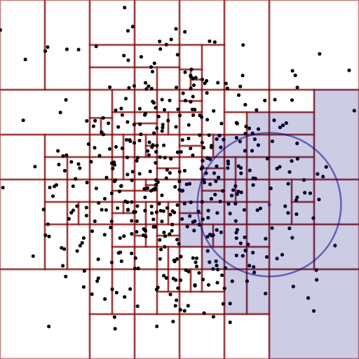

[](https://travis-ci.org/martinjrobins/Aboria)
[](https://coveralls.io/github/martinjrobins/Aboria?branch=master)
[](https://gitter.im/Aboria/Lobby?utm_source=badge&utm_medium=badge&utm_campaign=pr-badge&utm_content=badge)
<!---
[](https://ci.appveyor.com/project/martinjrobins/aboria)
-->

Aboria is a C++ library that enables computations over a set of particles or
points in N-dimensional space, with the aim of providing a useful library for
implementing particle-based numerical algorithms, for example Molecular
Dynamics, Smoothed Particle Hydrodynamics or Radial Basis Functions. 

### A standards-compliant particle container

The library gives you a STL compatible container class to store a particle set
containing a position and unique id for each particle, as well as any number of
user-defined variables with arbitrary types.

```cpp
ABORIA_VARIABLE(scalar, double, "an example scalar variable")
const int DIM = 2;
using Particles_t = Particles<std::tuple<scalar>,DIM>;
using position = Particles_t::position;
Particles_t particles(100);

std::normal_distribution<double> normal(0.5, 0.2);
std::default_random_engine gen;
for (auto i: particles) {
  get<position>(i) = vdouble2(normal(gen), normal(gen));
  get<scalar>(i) = normal(gen);
}
```

### Spatial data structures and queries

Aboria gives you the ability to embed each particle set within a hypercube
 domain with arbitrary periodicity. The underlying data structure can be a [cell
 list](https://en.wikipedia.org/wiki/Cell_lists),
 [kd-tree](https://en.wikipedia.org/wiki/K-d_tree) or hyper
 [oct-tree](https://en.wikipedia.org/wiki/Octree).

&nbsp;&nbsp;&nbsp;&nbsp;&nbsp;&nbsp;

These data structures provide flexible neighbourhood queries that return
iterators, and can use any integer
[p-norm](https://en.wikipedia.org/wiki/Norm_(mathematics)) distance measure for
`p > 0`. 

```cpp
for (auto i = euclidean_search(particles.get_query(),
                               vdouble2::Constant(0), radius);
         i != false; ++i) {
  std::cout << "Found a particle with dx = " << i.dx()
            << " and id = " << get<id>(*i) << "\n";
}
```

### An API for forming linear kernel operators 

Aboria gives you an API for forming linear kernel operators from C++ lambda
functions, This can be used, for example, to implement Radial Basis Function
kernels. These can be wrapped as [Eigen](eigen.tuxfamily.org) matrices in order
to solve linear systems.

```cpp
auto K = create_sparse_operator(
    particles, particles, radius,
    [epsilon](const vdouble2 &dx, auto i, auto j) {
      return (get<scalar>(i) * get<scalar>(j)) / (dx.norm() + epsilon);
    });

// matrix-vector multiply (matrix-free)
const int N = particles.size();
Eigen::VectorXd b = Eigen::VectorXd::LinSpaced(N, 0, 1.0);
Eigen::VectorXd c = K * b;

// matrix-vector multiply (assemble to a matrix first)
Eigen::MatrixXd K_eigen(N, N);
K.assemble(K_eigen);
c = K_eigen * b;
```

### License and Contact
    
Aboria is distributed under a BSD 3-Clause License, see LICENCE for more 
details. For documentation see the [Aboria 
website](https://martinjrobins.github.io/Aboria). If you are interested in 
contributing to Aboria, having trouble getting it working or just have a 
question, send me an email at <martin.robinson@cs.ox.ac.uk> or create a
GitHub issue or pull request.
